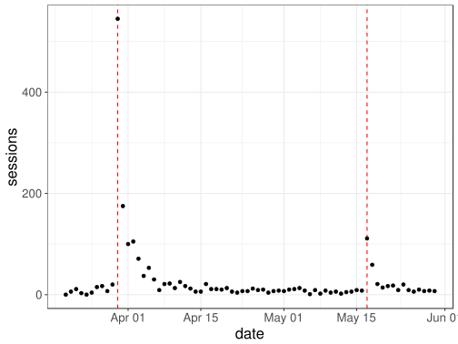

# Developing an international network


## Objective

The goal is to develop an international network. There are many advantages of having a large international network, but I won't develop this point. I want to develop an international network in two different communities, that of the language R (in priority) and that of the analysis of genetic data (my subject of thesis). For that, I try to become more and more visible on the international scene.

## Using Google Analytics and R

To get a sense of who is reading my blog and check my personal webpage, I decided to follow the flow of people on my blog and website using Google Analytics.

I can access Google Analytics API in R:


```r
library(googleAnalyticsR)
ga_auth(".httr-oauth")
ga_account_list()
```

<div data-pagedtable="false">
  <script data-pagedtable-source type="application/json">
{"columns":[{"label":["accountId"],"name":[1],"type":["chr"],"align":["left"]},{"label":["accountName"],"name":[2],"type":["chr"],"align":["left"]},{"label":["internalWebPropertyId"],"name":[3],"type":["chr"],"align":["left"]},{"label":["level"],"name":[4],"type":["chr"],"align":["left"]},{"label":["websiteUrl"],"name":[5],"type":["chr"],"align":["left"]},{"label":["webPropertyId"],"name":[6],"type":["chr"],"align":["left"]},{"label":["webPropertyName"],"name":[7],"type":["chr"],"align":["left"]},{"label":["type"],"name":[8],"type":["chr"],"align":["left"]},{"label":["viewId"],"name":[9],"type":["chr"],"align":["left"]},{"label":["viewName"],"name":[10],"type":["chr"],"align":["left"]}],"data":[{"1":"100463316","2":"privefl","3":"172481062","4":"STANDARD","5":"https://privefl.github.io/advr38book/","6":"UA-100463316-5","7":"Advanced R course","8":"WEB","9":"172000044","10":"Toutes les données du site Web"},{"1":"100463316","2":"privefl","3":"147936030","4":"STANDARD","5":"http://r-in-grenoble.github.io/blog/","6":"UA-100463316-2","7":"Blog of the R user group in Grenoble","8":"WEB","9":"152777290","10":"Toutes les données du site Web"},{"1":"100463316","2":"privefl","3":"148988557","4":"STANDARD","5":"http://privefl.github.io/about.html","6":"UA-100463316-3","7":"Mon site web (About)","8":"WEB","9":"153879696","10":"Toutes les données du site Web"},{"1":"100463316","2":"privefl","3":"147313761","4":"STANDARD","5":"https://privefl.github.io/blog","6":"UA-100463316-1","7":"My R blog","8":"WEB","9":"152155542","10":"Toutes les données du site Web"}],"options":{"columns":{"min":{},"max":[10]},"rows":{"min":[10],"max":[10]},"pages":{}}}
  </script>
</div>


## Website and blog

First, just before the beginning of my thesis, I created my personal website and my blog on R. I try to blog fairly regularly about R and my blog is relayed on R-bloggers, a platform that brings together ~850 R bloggers and is read by thousands of people internationally. 

I'm also trying to create R packets and contribute to others via GitHub. GitHub is a good way to make your work visible internationally and facilitate collaborations.

## Twitter, an important tool for work

I also try to be visible on Twitter, which is used by both communities that are of interest for me. 
<!-- I'm starting to have followers, even though I have not yet released any official "R" paper or package. I intend to remedy this by going to present a package of community R 1000 people (http://sched.co/Axrw). It will also be an opportunity to meet people and make contacts. -->

### Importance of twitter

Two tweets about my R course:

<blockquote class="twitter-tweet" data-lang="en" align="center"><p lang="en" dir="ltr">Teaching an advanced R course <a href="https://t.co/2pMG2FWcPs">https://t.co/2pMG2FWcPs</a> <a href="https://twitter.com/hashtag/rstats?src=hash&amp;ref_src=twsrc%5Etfw">#rstats</a> <a href="https://twitter.com/hashtag/DataScience?src=hash&amp;ref_src=twsrc%5Etfw">#DataScience</a></p>&mdash; R-bloggers (@Rbloggers) <a href="https://twitter.com/Rbloggers/status/979539984679161857?ref_src=twsrc%5Etfw">30 mars 2018</a></blockquote>
<script async src="https://platform.twitter.com/widgets.js" charset="utf-8"></script>


<blockquote class="twitter-tweet" data-lang="en" align="center"><p lang="en" dir="ltr">If you are at the airport today waiting for your ✈️, here&#39;s something good to read: <br>&quot;Advanced <a href="https://twitter.com/hashtag/RStats?src=hash&amp;ref_src=twsrc%5Etfw">#RStats</a> Course&quot; by <a href="https://twitter.com/privefl?ref_src=twsrc%5Etfw">@privefl</a>  <a href="https://t.co/JXKBI5lON2">https://t.co/JXKBI5lON2</a></p>&mdash; Colin Fay (@_ColinFay) <a href="https://twitter.com/_ColinFay/status/997073282905067520?ref_src=twsrc%5Etfw">17 mai 2018</a></blockquote>
<script async src="https://platform.twitter.com/widgets.js" charset="utf-8"></script>

Number of visitors of my course:


```r
library(tidyverse)
library(lubridate)
myggplot <- function(..., coeff = 1) {
  ggplot(...) + bigstatsr::theme_bigstatsr(size.rel = coeff)
}
```


```r
data_course <- google_analytics(
  viewId = "172000044",
  date_range = ymd("2018-03-20", Sys.Date()),
  dimensions = c("date"),  # , "pagePath", "hour", "medium"
  metrics = c("sessions")  # , "pageviews"
)
```

```
#> 2018-05-29 13:16:16> Downloaded [71] rows from a total of [71].
```

```r
myggplot(data_course) + 
  geom_vline(xintercept = ymd("2018-03-30", "2018-05-17"), 
             linetype = 2, color = "red") + 
  geom_point(aes(date, sessions))
```



Here, you can clearly see two peaks of visit of [my advanced R course](https://privefl.github.io/advr38book/), one when I blogged about it, which was relayed by R-bloggers, and the other peak when [Colin Fay](https://twitter.com/_colinfay) (4600 followers) tweeted about it.

## Attending conferences

To develop an international network, it is also very important to attend conferences, which I'm trying to do.

<blockquote class="twitter-tweet" data-lang="en" align="center"><p lang="en" dir="ltr">Use bigstatsr <a href="https://twitter.com/hashtag/rstats?src=hash&amp;ref_src=twsrc%5Etfw">#rstats</a> package for matrices larger than 100GB. Great ⚡ talk by <a href="https://twitter.com/privefl?ref_src=twsrc%5Etfw">@privefl</a> at <a href="https://twitter.com/erum2018?ref_src=twsrc%5Etfw">@erum2018</a> <a href="https://twitter.com/hashtag/erum2018?src=hash&amp;ref_src=twsrc%5Etfw">#erum2018</a> <a href="https://twitter.com/hashtag/DataScience?src=hash&amp;ref_src=twsrc%5Etfw">#DataScience</a> <a href="https://t.co/magBeDTyVz">pic.twitter.com/magBeDTyVz</a></p>&mdash; Peter Laurinec (@petolauri) <a href="https://twitter.com/petolauri/status/996338652820201472?ref_src=twsrc%5Etfw">15 mai 2018</a></blockquote>
<script async src="https://platform.twitter.com/widgets.js" charset="utf-8"></script>

Conferences I participated in:

- [eRum 2018](https://2018.erum.io/): An R package for statistical tools with big matrices stored on disk. [[Slides]](https://privefl.github.io/eRum-2018/slides.html)

- [Recomb-Genetics 2018](http://recomb2018.fr/recomb-genetics/): Predicting complex diseases: performance and robustness. [[Slides]](https://privefl.github.io/thesis-docs/recomb18.html)

- [LIFE 2018](https://life.univ-grenoble-alpes.fr/life-world/events-news/life-annual-meeting-725690.htm?RH=11210192165071361): Predicting complex diseases: performance and robustness. [[Slides]](https://github.com/privefl/paper2-PRS/blob/master/LIFE/pres-f-priv%C3%A9.pdf)

- [hackseq 2017](http://www.hackseq.com/): Developing advanced R tutorials for genomic data analysis. [[Website]](https://hackseq.github.io/2017_project_5/)

- [useR!2017](https://user2017.brussels/): The R package bigstatsr:
Memory- and Computation-Efficient Tools for Big Matrices. [[Recording]](https://t.co/aYt0q8MeXJ)

## A local network

Finally, in addition to taking part in an international community, I think it's very important to take part in a more local community. That's why I launched the initiative to make a R community in Grenoble, which starts to be active in September 2017 (https://r-in-grenoble.github.io/).

## Conclusion

Thus, my international network is under development. We can consider that it is a process that takes time, but that the indicators show that I am on the right track.


