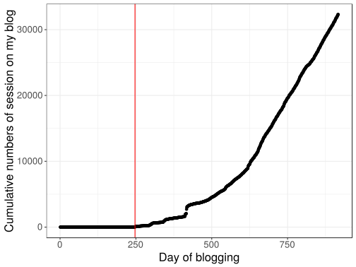

# Developing an international network


## Objective

There are many advantages of having a large international network. For example,

- I can get opportunities of work and collaboration,

- I can share my open source work to give back to the community,

- I get motivation from people recognizing my work.

I want to develop an international network in two different communities:

- that of programming language R (~~in priority~~) and
 
- that of the analysis of genetic data ("Predictive Human Genetics" -- my thesis subject). 

In order to achieve this, I am trying to become more and more **visible on the international scene** in many different ways.

## Getting more visible

### Check this using Google Analytics and R

In order to get a sense of who is interested in me and my work, I decided to follow the flow of people on my websites using Google Analytics.

I can access Google Analytics API in R:


```r
library(tidyverse)
library(lubridate)
library(googleAnalyticsR)
ga_auth(".httr-oauth")
select(ga_account_list(), c(webPropertyName, websiteUrl, viewId)) 
```

<div class="kable-table">

webPropertyName                        websiteUrl                              viewId    
-------------------------------------  --------------------------------------  ----------
Advanced R course                      https://privefl.github.io/advr38book/   172000044 
Blog of the R user group in Grenoble   http://r-in-grenoble.github.io/blog/    152777290 
My R blog                              https://privefl.github.io/blog          152155542 
My website (About)                     http://privefl.github.io/about.html     153879696 

</div>


### Website and blog

First, just before the beginning of my thesis, I created my personal website and my blog about R. I try to blog fairly regularly about R and my blog is relayed on R-bloggers, a platform that brings together ~750 R bloggers and is read by thousands of people internationally. 

More and more people are coming to by blog:


```r
data_blog <- google_analytics(
  viewId = "152155542",
  date_range = ymd("2016-10-01", Sys.Date()),
  dimensions = "date",
  metrics = "sessions"
)
```

```
#> 2019-04-05 09:33:17> Downloaded [917] rows from a total of [917].
```

```r
# No data from Google Analytics before this date
ga_begin <- which(data_blog$date == "2017-06-04")

qplot(y = cumsum(data_blog$sessions)) + 
  geom_vline(xintercept = ga_begin, color = "red") + 
  bigstatsr::theme_bigstatsr() + 
  labs(x = "Day of blogging", y = "Cumulative numbers of session on my blog")
```



```r
avg_time <- google_analytics(
  viewId = "152155542",
  date_range = ymd("2017-06-04", Sys.Date()),
  metrics = "avgSessionDuration"
)
```

```
#> 2019-04-05 09:33:19> Downloaded [1] rows from a total of [1].
```

```r
cat("The average time for each session is", avg_time[[1]], "seconds.\n")
```

```
#> The average time for each session is 36.77148 seconds.
```


### GitHub

GitHub is a platform where you can put your code. GitHub is a good way to make your work visible internationally and facilitate collaborations. On GitHub, I'm trying to create useful R packages and contribute to other packages. 

### Twitter, an important tool for work

I also try to be visible on Twitter, which is used by both communities that are of interest for me to communicate about new stuff. For example, look at [this article in Nature](https://www.nature.com/articles/d41586-019-00535-w) "How to use Twitter to further your research career" and [this blog post](https://academicpositions.com/career-advice/why-academics-should-use-twitter) "Why Academics Should Use Twitter".

To convince you, these are three tweets about my R course (topic of the next chapter):

<blockquote class="twitter-tweet" data-lang="en" align="center"><p lang="en" dir="ltr">Teaching an advanced R course <a href="https://t.co/2pMG2FWcPs">https://t.co/2pMG2FWcPs</a> <a href="https://twitter.com/hashtag/rstats?src=hash&amp;ref_src=twsrc%5Etfw">#rstats</a> <a href="https://twitter.com/hashtag/DataScience?src=hash&amp;ref_src=twsrc%5Etfw">#DataScience</a></p>&mdash; R-bloggers (@Rbloggers) <a href="https://twitter.com/Rbloggers/status/979539984679161857?ref_src=twsrc%5Etfw">30 mars 2018</a></blockquote>
<script async src="https://platform.twitter.com/widgets.js" charset="utf-8"></script>

<blockquote class="twitter-tweet" data-lang="en" align="center"><p lang="en" dir="ltr">If you are at the airport today waiting for your ✈️, here&#39;s something good to read: <br>&quot;Advanced <a href="https://twitter.com/hashtag/RStats?src=hash&amp;ref_src=twsrc%5Etfw">#RStats</a> Course&quot; by <a href="https://twitter.com/privefl?ref_src=twsrc%5Etfw">@privefl</a>  <a href="https://t.co/JXKBI5lON2">https://t.co/JXKBI5lON2</a></p>&mdash; Colin Fay (@_ColinFay) <a href="https://twitter.com/_ColinFay/status/997073282905067520?ref_src=twsrc%5Etfw">17 mai 2018</a></blockquote>
<script async src="https://platform.twitter.com/widgets.js" charset="utf-8"></script>

<blockquote class="twitter-tweet" data-lang="en" align="center"><p lang="en" dir="ltr">Finished teaching my advanced <a href="https://twitter.com/hashtag/rstats?src=hash&amp;ref_src=twsrc%5Etfw">#rstats</a> course for PhD students for the 2nd year 💪<br><br>Contents:<br>- good practices and rprog<br>- <a href="https://twitter.com/hashtag/tidyverse?src=hash&amp;ref_src=twsrc%5Etfw">#tidyverse</a><br>- performance ⚡️<br>- packages 📦<br>- <a href="https://twitter.com/hashtag/shiny?src=hash&amp;ref_src=twsrc%5Etfw">#shiny</a><br><br>Materials always available as an online <a href="https://twitter.com/hashtag/bookdown?src=hash&amp;ref_src=twsrc%5Etfw">#bookdown</a>:<a href="https://t.co/Ph0yNo6X93">https://t.co/Ph0yNo6X93</a></p>&mdash; Florian Privé (@privefl) <a href="https://twitter.com/privefl/status/1112999031301685249?ref_src=twsrc%5Etfw">2 avril 2019</a></blockquote>
<script async src="https://platform.twitter.com/widgets.js" charset="utf-8"></script>

In parallel, let's plot the number of visitors of my course:


```r
data_course <- google_analytics(
  viewId = "172000044",
  date_range = ymd("2018-03-20", Sys.Date()),
  dimensions = c("date"),  # , "pagePath", "hour", "medium"
  metrics = c("sessions")  # , "pageviews"
)
```

```
#> 2019-04-05 09:33:20> Downloaded [382] rows from a total of [382].
```

```r
ggplot(data_course) + 
  geom_vline(xintercept = ymd("2018-03-30", "2018-05-17", "2019-04-02"), 
             linetype = 2, color = "red") + 
  geom_point(aes(date, sessions)) + 
  bigstatsr::theme_bigstatsr()
```


Here, you can clearly see three peaks of visits of [my advanced R course](https://privefl.github.io/advr38book/), one when I blogged about it, which was relayed by [R-bloggers](https://twitter.com/Rbloggers) (59K followers at the time), one other peak when [Colin Fay](https://twitter.com/_colinfay) (4600+ followers) tweeted about it, and the last peak when I tweeted about it after having finished teaching it for the second year.

### Attending conferences

To develop an international network, it is also very important to attend conferences, which I'm also trying to do.

<blockquote class="twitter-tweet" data-lang="en" align="center"><p lang="en" dir="ltr">Use bigstatsr <a href="https://twitter.com/hashtag/rstats?src=hash&amp;ref_src=twsrc%5Etfw">#rstats</a> package for matrices larger than 100GB. Great ⚡ talk by <a href="https://twitter.com/privefl?ref_src=twsrc%5Etfw">@privefl</a> at <a href="https://twitter.com/erum2018?ref_src=twsrc%5Etfw">@erum2018</a> <a href="https://twitter.com/hashtag/erum2018?src=hash&amp;ref_src=twsrc%5Etfw">#erum2018</a> <a href="https://twitter.com/hashtag/DataScience?src=hash&amp;ref_src=twsrc%5Etfw">#DataScience</a> <a href="https://t.co/magBeDTyVz">pic.twitter.com/magBeDTyVz</a></p>&mdash; Peter Laurinec (@petolauri) <a href="https://twitter.com/petolauri/status/996338652820201472?ref_src=twsrc%5Etfw">15 mai 2018</a></blockquote>
<script async src="https://platform.twitter.com/widgets.js" charset="utf-8"></script>

This is me on stage in Budapest in May 2018. Before this conference, I had 118 followers on Twitter; after 3 days of conference, I had 158 (+34%).

I've also presented my work elsewhere, such as in Paris and in Denmark.

<blockquote class="twitter-tweet" data-lang="en" align="center"><p lang="en" dir="ltr">Back in 🇫🇷. I had a great time in 🇩🇰 meeting <a href="https://twitter.com/bvilhjal?ref_src=twsrc%5Etfw">@bvilhjal</a>, <a href="https://twitter.com/eagerbo?ref_src=twsrc%5Etfw">@eagerbo</a>, <a href="https://twitter.com/jakob_grove?ref_src=twsrc%5Etfw">@jakob_grove</a>, T. Bataillon, <a href="https://twitter.com/dougthespeed?ref_src=twsrc%5Etfw">@dougthespeed</a> and others. Thanks <a href="https://twitter.com/bvilhjal?ref_src=twsrc%5Etfw">@bvilhjal</a> for everything. I might come back later 😉 <a href="https://t.co/gd06D9Ojqp">pic.twitter.com/gd06D9Ojqp</a></p>&mdash; Florian Privé (@privefl) <a href="https://twitter.com/privefl/status/1085940170904559616?ref_src=twsrc%5Etfw">17 janvier 2019</a></blockquote>
<script async src="https://platform.twitter.com/widgets.js" charset="utf-8"></script>


Conferences I presented at:

- [Rencontres R 2018](https://r2018-rennes.sciencesconf.org/): The R package bigstatsr: Memory- and Computation-Efficient Statistical Tools for Big Matrices [[Slides]](https://privefl.github.io/RR18/bigstatsr.html)

- [eRum 2018](https://2018.erum.io/): An R package for statistical tools with big matrices stored on disk. [[Recording]](https://youtu.be/w3a1-KLmDM8) [[Slides]](https://privefl.github.io/eRum-2018/slides.html)

- [Recomb-Genetics 2018](http://recomb2018.fr/recomb-genetics/): Predicting complex diseases: performance and robustness. [[Slides]](https://privefl.github.io/thesis-docs/recomb18.html)

- [LIFE 2018](https://life.univ-grenoble-alpes.fr/life-world/events-news/life-annual-meeting-725690.htm?RH=11210192165071361): Predicting complex diseases: performance and robustness. [[Slides]](https://github.com/privefl/paper2-PRS/blob/master/LIFE/pres-f-priv%C3%A9.pdf)

- [hackseq 2017](http://www.hackseq.com/): Developing advanced R tutorials for genomic data analysis. [[Website]](https://hackseq.github.io/2017_project_5/)

- [useR!2017](https://user2017.brussels/): The R package bigstatsr:
Memory- and Computation-Efficient Tools for Big Matrices. [[Recording]](https://t.co/aYt0q8MeXJ)

### A local network

Finally, in addition to taking part in an international community, I think it's very important to take part in a more local community. That's one reason why I launched the initiative to make an R community in Grenoble, which started to be active in September 2017. Learn more about how we organize this R group by looking at [its website](https://r-in-grenoble.github.io/).

I'm also an active member in the French community; we have been [gathering on Slack](https://join.slack.com/t/r-grrr/shared_invite/enQtMzI4MzgwNTc4OTAxLWZlOGZiZTBiMWU0NDQ3OTYzOGE1YThiODgwZWNhNWEyYjI4ZDJiNmNhY2YyYWI5YzFiOTFkNDYxYzkwODUwNWM), with 450+ members.

<!-- ## What's make people be interested in me? -->

<!-- Is this my blog posts? the conferences I attend? or the paper I wrote? -->

<!-- ```{r} -->
<!-- data_about <- google_analytics( -->
<!--   viewId = "153879696", -->
<!--   date_range = ymd("2017-06-26", Sys.Date()), -->
<!--   dimensions = c("date"),  # , "pagePath", "hour", "medium" -->
<!--   metrics = c("sessions")  # , "pageviews" -->
<!-- ) -->

<!-- blog_dates <- list.files("../blog/_posts/") %>% -->
<!--   str_sub(end = 10) %>% -->
<!--   parse_date() %>%  -->
<!--   print() -->

<!-- conf_dates <- ymd("2017-07-04", "2017-07-07",  # useR! -->
<!--                   "2018-04-19", "2018-04-20",  # recomb -->
<!--                   "2018-05-14", "2018-05-16")  # eRum -->

<!-- papers_dates <- ymd("2017-09-17", "2018-05-05") -->

<!-- data_about %>% -->
<!--   arrange(desc(sessions)) %>% -->
<!--   head() -->
<!-- ``` -->

<!-- ```{r, out.width="95%"} -->
<!-- important_dates <- data.frame(date = c(blog_dates[-(1:7)], conf_dates, papers_dates)) -->

<!-- ggplot(data_about, aes(yday(date), sessions)) + -->
<!--   facet_grid(format(date, format = "%Y") ~ .) +  -->
<!--   geom_vline(aes(xintercept = yday(date)), data = important_dates, -->
<!--              color = "blue", linetype = 2, size = 1) + -->
<!--   geom_point(size = 2) + -->
<!--   geom_line(aes(group = 1), size = 0.8) + -->
<!--   geom_smooth(method = "loess", span = 0.25, color = "red") + -->
<!--   bigstatsr::theme_bigstatsr() + -->
<!--   theme(axis.text.x = element_text(angle = 45, hjust = 1)) + -->
<!--   labs(x = "Day number", y = "Number of sessions on my #About webpage") -->
<!-- ``` -->

<!-- It seems that blogging about my advanced R course materials is what got me the largest number of people coming to my webpage to learn more about me.  -->

## Retrospective thoughts

I've invested quite some time in R because I didn't want to continue in Research at first.

Now, I'm starting to switch to the "human genetics" community where I will possibly work. Maybe, I should have started earlier as it is hard to enter new research fields (since my thesis supervisors are not directly from this field).

## Conclusion

Thus, my international network is under development.

I'm using my blog (2K active users each month), Twitter (300+ followers), GitHub (150+ stars), Stack Overflow (~84K people reached) and conferences to get people to know me and want to work with me.

We can consider that it is a process that takes time, yet the indicators show that I am on the right track. 
It has already paid off for my career as I have already received 5 postdoc offers.

I'm leaving for Denmark in May to meet and work with new people. I will also be lecturer in some [Machine Learning for Health and Bioinformatics workshop](https://www.kcl.ac.uk/ioppn/depts/biostatisticshealthinformatics/teaching/courses/machine-learning) at King's College London.
