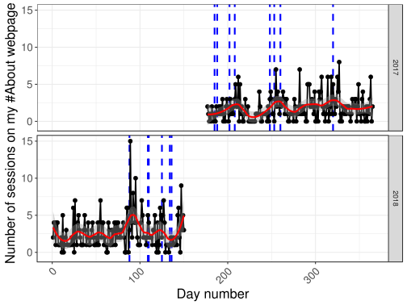

# Developing an international network


## Objective

The goal is to develop an international network. 
There are many advantages of having a large international network, but I won't develop this point. 
I want to develop an international network in two different communities, that of programming language R (in priority) and that of the analysis of genetic data (my subject of thesis). 
In order to achieve this, I am trying to become more and more visible on the international scene.

## Using Google Analytics and R

After the 3rd session of label RES (June 26, 2017), in order to get a sense of who is reading my blog and check my personal webpage, I decided to follow the flow of people on my blog and website using Google Analytics.

I can access Google Analytics API in R:


```r
library(tidyverse)
library(lubridate)
library(googleAnalyticsR)
ga_auth(".httr-oauth")
select(ga_account_list(), c(webPropertyName, websiteUrl, viewId)) 
```

<div class="kable-table">

webPropertyName                        websiteUrl                              viewId    
-------------------------------------  --------------------------------------  ----------
Advanced R course                      https://privefl.github.io/advr38book/   172000044 
Blog of the R user group in Grenoble   http://r-in-grenoble.github.io/blog/    152777290 
My R blog                              https://privefl.github.io/blog          152155542 
My website (About)                     http://privefl.github.io/about.html     153879696 

</div>


## Website and blog

First, just before the beginning of my thesis, I created my personal website and my blog on R. I try to blog fairly regularly about R and my blog is relayed on R-bloggers, a platform that brings together ~850 R bloggers and is read by thousands of people internationally. 

I'm also trying to create R packages and contribute to others via GitHub. GitHub is a good way to make your work visible internationally and facilitate collaborations.

## Twitter, an important tool for work

I also try to be visible on Twitter, which is used by both communities that are of interest for me. 
<!-- I'm starting to have followers, even though I have not yet released any official "R" paper or package. I intend to remedy this by going to present a package of community R 1000 people (http://sched.co/Axrw). It will also be an opportunity to meet people and make contacts. -->

### Importance of twitter

Two tweets about my R course:

<blockquote class="twitter-tweet" data-lang="en" align="center"><p lang="en" dir="ltr">Teaching an advanced R course <a href="https://t.co/2pMG2FWcPs">https://t.co/2pMG2FWcPs</a> <a href="https://twitter.com/hashtag/rstats?src=hash&amp;ref_src=twsrc%5Etfw">#rstats</a> <a href="https://twitter.com/hashtag/DataScience?src=hash&amp;ref_src=twsrc%5Etfw">#DataScience</a></p>&mdash; R-bloggers (@Rbloggers) <a href="https://twitter.com/Rbloggers/status/979539984679161857?ref_src=twsrc%5Etfw">30 mars 2018</a></blockquote>
<script async src="https://platform.twitter.com/widgets.js" charset="utf-8"></script>


<blockquote class="twitter-tweet" data-lang="en" align="center"><p lang="en" dir="ltr">If you are at the airport today waiting for your ✈️, here&#39;s something good to read: <br>&quot;Advanced <a href="https://twitter.com/hashtag/RStats?src=hash&amp;ref_src=twsrc%5Etfw">#RStats</a> Course&quot; by <a href="https://twitter.com/privefl?ref_src=twsrc%5Etfw">@privefl</a>  <a href="https://t.co/JXKBI5lON2">https://t.co/JXKBI5lON2</a></p>&mdash; Colin Fay (@_ColinFay) <a href="https://twitter.com/_ColinFay/status/997073282905067520?ref_src=twsrc%5Etfw">17 mai 2018</a></blockquote>
<script async src="https://platform.twitter.com/widgets.js" charset="utf-8"></script>

Number of visitors of my course:


```r
data_course <- google_analytics(
  viewId = "172000044",
  date_range = ymd("2018-03-20", Sys.Date()),
  dimensions = c("date"),  # , "pagePath", "hour", "medium"
  metrics = c("sessions")  # , "pageviews"
)
```

```
#> 2018-05-29 17:33:49> Downloaded [71] rows from a total of [71].
```

```r
ggplot(data_course) + 
  geom_vline(xintercept = ymd("2018-03-30", "2018-05-17"), 
             linetype = 2, color = "red") + 
  geom_point(aes(date, sessions)) + 
  bigstatsr::theme_bigstatsr()
```


Here, you can clearly see two peaks of visit of [my advanced R course](https://privefl.github.io/advr38book/), one when I blogged about it, which was relayed by R-bloggers, and the other peak when [Colin Fay](https://twitter.com/_colinfay) (4600+ followers) tweeted about it.

## Attending conferences

To develop an international network, it is also very important to attend conferences, which I'm also trying to do.

<blockquote class="twitter-tweet" data-lang="en" align="center"><p lang="en" dir="ltr">Use bigstatsr <a href="https://twitter.com/hashtag/rstats?src=hash&amp;ref_src=twsrc%5Etfw">#rstats</a> package for matrices larger than 100GB. Great ⚡ talk by <a href="https://twitter.com/privefl?ref_src=twsrc%5Etfw">@privefl</a> at <a href="https://twitter.com/erum2018?ref_src=twsrc%5Etfw">@erum2018</a> <a href="https://twitter.com/hashtag/erum2018?src=hash&amp;ref_src=twsrc%5Etfw">#erum2018</a> <a href="https://twitter.com/hashtag/DataScience?src=hash&amp;ref_src=twsrc%5Etfw">#DataScience</a> <a href="https://t.co/magBeDTyVz">pic.twitter.com/magBeDTyVz</a></p>&mdash; Peter Laurinec (@petolauri) <a href="https://twitter.com/petolauri/status/996338652820201472?ref_src=twsrc%5Etfw">15 mai 2018</a></blockquote>
<script async src="https://platform.twitter.com/widgets.js" charset="utf-8"></script>

Conferences I participated in:

- [eRum 2018](https://2018.erum.io/): An R package for statistical tools with big matrices stored on disk. [[Slides]](https://privefl.github.io/eRum-2018/slides.html)

- [Recomb-Genetics 2018](http://recomb2018.fr/recomb-genetics/): Predicting complex diseases: performance and robustness. [[Slides]](https://privefl.github.io/thesis-docs/recomb18.html)

- [LIFE 2018](https://life.univ-grenoble-alpes.fr/life-world/events-news/life-annual-meeting-725690.htm?RH=11210192165071361): Predicting complex diseases: performance and robustness. [[Slides]](https://github.com/privefl/paper2-PRS/blob/master/LIFE/pres-f-priv%C3%A9.pdf)

- [hackseq 2017](http://www.hackseq.com/): Developing advanced R tutorials for genomic data analysis. [[Website]](https://hackseq.github.io/2017_project_5/)

- [useR!2017](https://user2017.brussels/): The R package bigstatsr:
Memory- and Computation-Efficient Tools for Big Matrices. [[Recording]](https://t.co/aYt0q8MeXJ)

## A local network

Finally, in addition to taking part in an international community, I think it's very important to take part in a more local community. That's one reason why I launched the initiative to make an R community in Grenoble, which started to be active in September 2017 (https://r-in-grenoble.github.io/).

## What's make people be interested in me?

Is this my blog posts? the conferences I attend? or the paper I wrote?


```r
data_about <- google_analytics(
  viewId = "153879696",
  date_range = ymd("2017-06-26", Sys.Date()),
  dimensions = c("date"),  # , "pagePath", "hour", "medium"
  metrics = c("sessions")  # , "pageviews"
)
```

```
#> 2018-05-29 17:33:51> Downloaded [338] rows from a total of [338].
```

```r
blog_dates <- list.files("../blog/_posts/") %>%
  str_sub(end = 10) %>%
  parse_date() %>% print()
```

```
#>  [1] "2016-08-19" "2016-08-31" "2016-09-06" "2016-10-07" "2016-10-14" "2016-12-29" "2017-06-03"
#>  [8] "2017-07-21" "2017-07-27" "2017-09-05" "2017-09-10" "2017-11-16" "2018-03-29" "2018-04-19"
```

```r
conf_dates <- ymd("2017-07-04", "2017-07-07",  # useR!
                  "2018-04-19", "2018-04-20",  # recomb
                  "2018-05-14", "2018-05-16")  # eRum

papers_dates <- ymd("2017-09-17", "2018-05-05")

data_about %>%
  arrange(desc(sessions)) %>%
  head()
```

<div class="kable-table">

date          sessions
-----------  ---------
2018-03-30          15
2018-04-05          10
2018-05-27           9
2017-11-23           8
2018-04-02           8
2017-09-12           7

</div>


```r
important_dates <- data.frame(date = c(blog_dates[-(1:7)], conf_dates, papers_dates))

ggplot(data_about, aes(yday(date), sessions)) +
  facet_grid(format(date, format = "%Y") ~ .) + 
  geom_vline(aes(xintercept = yday(date)), data = important_dates,
             color = "blue", linetype = 2, size = 1) +
  geom_point(size = 2) +
  geom_line(aes(group = 1), size = 0.8) +
  geom_smooth(method = "loess", span = 0.25, color = "red") +
  bigstatsr::theme_bigstatsr() +
  theme(axis.text.x = element_text(angle = 45, hjust = 1)) +
  labs(x = "Day number", y = "Number of sessions on my #About webpage")
```



It seems that blogging about my advanced R course materials is what got we the largest number of people coming to my webpage to learn more about me. 

## Conclusion

Thus, my international network is under development. I'm using my blog, twitter, GitHub, Stack Overflow and conferences to get people to know me and want to collaborate with me.

We can consider that it is a process that takes time, yet the indicators show that I am on the right track.


