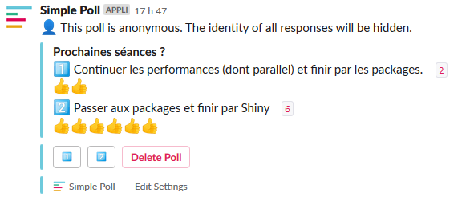

# Designing teaching materials

```{r setup, include=FALSE}
WORDS_TO_IGNORE <- c("DataCamp", "learnr", "sticked", "ENSIMAG")
source("knitr-options.R")
source("spelling-check.R")
```

Here, I come back to my experience teaching an advanced R course (R is a programming language with a lot of users in Statistics / Data Science). 

## Content

I planned this course in 10 sessions (of 3 hours each) for PhD students with some basics in R.

I initially wanted to talk about the following subjects:

1. R programming and good practices (2 sessions)

2. Data analysis with the tidyverse (3 sessions)

3. R code performance (2 sessions)

4. R packages (2 sessions)

5. Bonus: Shiny (1 session)

I basically sticked to this.

## Materials

At first, I wanted to do an interactive course using package [{learnr}](https://rstudio.github.io/learnr/) but it would have required way too much work (my thesis supervisor would not have been happy!).
So, I finally decided to use package [{bookdown}](https://bookdown.org/yihui/bookdown/). Using {bookdown} was really easy, and knowing how to use it is now useful (e.g. this website is made with {bookdown}).

Materials are available [there](https://privefl.github.io/advr38book/index.html).

I also decided to create an associated R package for many reasons:

- to make students install package dependencies that we needed in this course,

- to make data easily available to students,

- to make solutions available as functions in the package.

This idea of having a bookdown for materials with an associated package is not new (e.g. see [the *Efficient R Programming* book](https://bookdown.org/csgillespie/efficientR/) and [its associated package](https://github.com/csgillespie/efficient)).

I started bookmarking materials and ideas 6 months before starting the course so that I could present many interesting things, and students could deepen their knowledge on some topics, even if we didn't have time to cover everything in class. 
I also bookmarked some questions I had answered on Stack Overflow. I think these questions make good exercises because they come from real problem that other people have, the questions are short and well designed (with some data and code to reproduce the problem and some expected output), and I have already thought about a solution. **Students were really happy with the materials.**

## All chapters

1. I started the course with [good practices](https://privefl.github.io/advr38book/good-practices.html) such as coding style, using RStudio and Git, and getting help. I also introduced my students to [Slack](https://slack.com) so that we could communicate and share code.

2. I continued the course with some [base R programming](https://privefl.github.io/advr38book/r-programming.html). This is not the funniest part of the course, but knowing this seemed to me as inevitable to be proficient in R.

3. Then, [we learned about the tidyverse](https://privefl.github.io/advr38book/tidyverse.html) using [the R for Data Science book](http://r4ds.had.co.nz/). While teaching this course, I have discovered that many people still don't use {ggplot2} and {dplyr}, two packages that have been used by many people for more than 10 years. So, I had to introduce these two packages from scratch and it took me longer than I had anticipated. In 3 sessions (9h), I had the time to cover R Markdown, {ggplot2} and {dplyr} only.
    
4. After the tidyverse, I covered [performance of R code](https://privefl.github.io/advr38book/performance.html). I really like to solve performance problems on Stack Overflow and (I think) I'm really good at it. So, this may have been the chapter I could bring the most to the table. Moreover, one student came with one of the problem she had, and I used her problem as an exercise. At the end, she was able to make her code more than 1000 times faster. For the other exercises, I mainly used problems I had answered on Stack Overflow.

5. For the last chapter, we covered [how to make an R package](https://privefl.github.io/advr38book/packages.html). I showed them that it was really easy and fast, mainly thanks to R packages {usethis} and {roxygen2}. We had time to cover the full documentation, testing, automatic checking of packages and even how to make a website of a package.

6. Finally, the last session was a "bonus" session we could have used either to spend more time on any topic or just to learn something fun like {Shiny}. Indeed, we could have spent at least two more sessions on the tidyverse and one on practicing about performance of R code. 
Using a [Slack poll](https://simplepoll.rocks/), we agreed to [learn Shiny](https://privefl.github.io/advr38book/shiny.html). For this, I used [this nice and free DataCamp course](https://www.datacamp.com/courses/building-web-applications-in-r-with-shiny). 

## Retrospective thoughts

1. At least half of the materials I used is borrowed from others. At first, I felt bad about this because I felt lazy. But it has already taken me a lot of time to prepare these materials, just reinventing the wheel with some new materials that were already out there would have not been good for me or my students.

2. I think using {bookdown}, Git and Slack was a good idea. Indeed, using {bookdown} makes the structure of the course very clear. Moreover, other resources that I use are also in this format so that students are already familiar with it. Then, Git is so useful for everything related to code, so even if some students do not get the point of learning Git now, they will thank me later, especially since it is really easy to use Git with RStudio. Finally, Slack was really helpful to do many things such as sharing code or data to help students with their own problems and also to make some polls to choose between options (e.g. choosing what to cover in the last/bonus session).

    ```{r, out.width="70%", echo=FALSE}
    
    ```


3. I feel like I have covered lots of useful things. However, I would have wanted my course to be useful for more people (I had only 10-12 students). So, in order to get motivated to make these materials, I designed them to be used by other people anywhere in the world.

    ```{r, out.width="92%", message=FALSE}
    library(tidyverse)
    library(googleAnalyticsR)
    ga_auth(".httr-oauth")
    
    data_course_country <- google_analytics(
      viewId = "172000044",
      date_range = lubridate::ymd("2018-03-20", Sys.Date()),
      dimensions = c("country"),  # , "pagePath", "hour", "medium"
      metrics = c("sessions")  # , "pageviews"
    )
    sum(data_course_country$sessions)
    
    data_course_country %>%
      mutate(country2 = ifelse(sessions < 30, NA, country)) %>%
      ggplot(aes(reorder(country2, desc(sessions)), sessions)) +
      geom_col() + 
      scale_x_discrete(na.translate = FALSE) +
      bigstatsr::theme_bigstatsr() +
      theme(axis.text.x = element_text(angle = 45, hjust = 1)) + 
      labs(x = "Country", y = "Number of sessions", 
           title = "Number of sessions by country")
    ```

## New year

I'm teaching this course again this year (2019).
I was also teaching at ENSIMAG in the meantime, so that it is good that all materials were ready from last year since I would not have had time to prepare them again.

I have updated some small parts of the course, making sure that all code was still running, replacing exercises that were too hard, etc.

I also decided to plan only 9 sessions over 3 weeks instead of 10 sessions over 5 weeks as we did last year. Indeed, only one session about packages is sufficient and **students from last year reported that a course over 5 weeks was too long**.

<blockquote class="twitter-tweet" data-lang="en" align="center"><p lang="en" dir="ltr">Finished teaching my advanced <a href="https://twitter.com/hashtag/rstats?src=hash&amp;ref_src=twsrc%5Etfw">#rstats</a> course for PhD students for the 2nd year 💪<br><br>Contents:<br>- good practices and rprog<br>- <a href="https://twitter.com/hashtag/tidyverse?src=hash&amp;ref_src=twsrc%5Etfw">#tidyverse</a><br>- performance ⚡️<br>- packages 📦<br>- <a href="https://twitter.com/hashtag/shiny?src=hash&amp;ref_src=twsrc%5Etfw">#shiny</a><br><br>Materials always available as an online <a href="https://twitter.com/hashtag/bookdown?src=hash&amp;ref_src=twsrc%5Etfw">#bookdown</a>:<a href="https://t.co/Ph0yNo6X93">https://t.co/Ph0yNo6X93</a></p>&mdash; Florian Privé (@privefl) <a href="https://twitter.com/privefl/status/1112999031301685249?ref_src=twsrc%5Etfw">2 avril 2019</a></blockquote>
<script async src="https://platform.twitter.com/widgets.js" charset="utf-8"></script>


## All teachings

- courses and practical exercises in Mathematics for students in their first semester after high school (2 x 64H)

- advanced R course for PhD students (30H + 27H)

- introductory R course for PhD students (21H)

- statistical methods for first year engineer students (third year after high school) at ENSIMAG where I got my engineer degree 3 years ago (18H)

- software carpentry instructor (7H)

